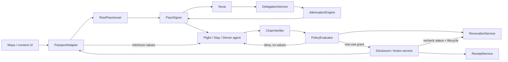

# RelayPass Architecture

## Architecture objective

RelayPass is a deterministic authorization layer between human-owned Passport context and delegated agents. It proves that a downstream pass is a valid, no-broader descendant of Maya's consent, then releases only the values required by an allowed request.

The prototype must make five technical truths real:

1. A typed root consent object exists.
2. Every child is mechanically checked to be no broader than its parent.
3. Root and child passes have real Ed25519/EdDSA signatures and parent linkage.
4. A verifier refuses out-of-scope context and actions before disclosure or side effects.
5. A live root or branch revocation invalidates the affected descendants.

Agents and external services may be deterministic simulations. Authorization may not be simulated with UI-only flags or delegated to a model.

## Source and integration boundary

The official ideathon guide defines the competition behavior, not an implementation API. The research report suggests derived passes, but Egoist has not yet validated whether a pass may be narrowed and delegated instead of requiring a fresh direct approval for each downstream app.

`PassportAdapter` is therefore a required anti-corruption boundary:

- The demo adapter supplies Maya's sample field catalog and approved values.
- Domain services depend on the adapter interface, not mock storage or an assumed private Egoist endpoint.
- Context values are fetched only after deterministic authorization succeeds.
- A future Egoist adapter can translate root requests, fresh downstream approvals, value reads, write proposals, status, and receipts without changing the core verifier.
- Product copy must describe child derivation as a prototype proposal pending Egoist validation.

The implemented adapter contract is deliberately narrow: it lists safe field metadata and
releases exact authorized values only when presented with an internal one-use grant. A future
Egoist adapter may add root-consent and fresh downstream-pass exchanges beside that contract;
it must not move value access, attenuation, or verifier decisions into the adapter.

If Egoist says passes are non-transferable, the adapter obtains a fresh downstream pass using a prefilled permission delta. The handoff tree and verifier remain; the trust anchor for the child changes from derived authorization to fresh holder authorization.

## System shape



The sequence is intentional: signature, chain, request proof, lifecycle, and live revocation checks happen before policy evaluation. An allow result creates a one-use internal grant, not a reusable authorization object. `ContextDisclosureService` or `ActionExecutionService` consumes that grant, rechecks lifecycle and revocation immediately before the read or side effect, and records success only afterward.

## Module responsibilities

| Module | Responsibility | Must not do |
| --- | --- | --- |
| `PassportAdapter` | Request/approve root scope, expose field metadata, return approved values after allow, propose writes, and translate status/receipt behavior | Pretend a private Egoist API is integrated; return values before allow |
| `RootPassIssuer` | Convert approved `RootConsent` into the root `RelayPass` | Expand beyond the recorded approval |
| `AttenuationEngine` | Compare parent and requested child across every monotonic dimension; return a typed result | Use natural-language or model judgment; sign a failed derivation |
| `DelegationService` | Verify the full parent chain and live status before invoking attenuation and signing | Derive from an expired, revoked, forged, or incomplete parent chain |
| `PassSigner` | Canonically encode and sign the unsigned pass with EdDSA; attach `kid` and compact JWS proof | Sign unvalidated data or context values |
| `ChainVerifier` | Validate schemas, trust anchor, signatures, IDs, hashes, and attenuation for every parent-child edge | Trust a child-provided summary of its parent |
| `RevocationService` | Record root/branch status and answer a live status query for a chain | Treat status at issuance as current status |
| `PolicyEvaluator` | Verify a delegate-signed request, configured verifier, purpose, replay state, context, action, target, and constraints | Fetch values, perform side effects, accept caller-selected clocks, or ask an LLM to decide |
| `ContextDisclosureService` | Consume a one-use grant, recheck status/lifecycle, release minimum values, then receipt the completed read | Accept a caller-created decision as authority |
| `ActionExecutionService` | Consume a request-bound one-use grant, recheck status/lifecycle, run the simulated callback, then receipt success | Execute from a stale plain allow result |
| `ReceiptService` | Append receipts for reads, actions, refusals, step-up, writes, and revocations | Store unnecessary secret values or mutate prior receipts |
| Repository adapters | Persist passes, revocations, and receipts behind interfaces | Make external database setup a prerequisite for the demo |
| Simulated agents/verifiers | Exercise the real pass APIs with fixed requests and display decisions | Claim autonomous agents or real merchant integrations |

## Domain model

Zod schemas define runtime boundaries; TypeScript types are inferred from them where practical.

### Core objects

- `RootConsent`: Maya's approved ceiling for Nova, including structured purpose, exact context paths, capabilities, audiences, lifecycle, and maximum delegation depth.
- `RelayPass`: the signed root or child authorization envelope.
- `ContextPermission`: exact `read` and `proposeWrites` paths plus `neverDisclose` and `stepUpRequired` restriction sets.
- `ActionCapability`: an action name, target set, typed constraints, and human-approval requirement.
- `Purpose`: stable task ID, display statement, and machine-comparable scope set.
- `Audience`: allowed agent and service IDs.
- `DelegationPolicy`: allowed flag, current depth, maximum depth, and mandatory attenuation marker.
- `Lifecycle`: `validFrom` and `validUntil`.
- `AgentIdentity`: pairwise agent ID, display name, key ID, and Ed25519 public JWK.
- `VerifierRequest`: request ID, presenting agent, receiving service, requested paths, and optional action.
- `VerifierDecision`: stable allow/deny code, semantic status, disclosed path list, and optional receipt ID.
- `RelayReceipt`: immutable metadata describing what was requested, disclosed, allowed, or refused.
- `RevocationState`: live active/revoked state for a root or branch.

### Signed envelope versus values

RelayPass separates authorization from personal data.

The signed pass contains:

- IDs and parent linkage
- holder pairwise ID
- issuer and delegate key binding
- exact context paths, not their values
- action names, targets, and policy constraints such as a $650 maximum
- machine-comparable purpose scopes and audience IDs
- delegation and lifecycle bounds
- receipt and revocation metadata

The signed pass does not contain values such as Maya's origin city, address, diagnosis, or dietary explanation. After an allowed decision, `PassportAdapter` returns a separate minimum payload for only the requested authorized paths. For example, DinnerAgent may receive `{ dietary.nut_free_required: true }`; it never receives the diagnosis that motivated the requirement.

Receipts record requested and disclosed path names and hashes of consequential arguments. They avoid copying raw personal values unless a future audited requirement explicitly demands one.

## Monotonic attenuation contract

For every parent `P` and child `C`, derivation succeeds only if all rules below pass. Equality is safe; the canonical demo deliberately shrinks visible scope.

### Identity and linkage

- `C.rootConsentId === P.rootConsentId`.
- `C.parentPassId === P.passId`.
- `C.parentPassHash === canonicalHash(P)`.
- `C.holder.pairwiseId === P.holder.pairwiseId` in the prototype; a child cannot select another tenant. Production branch-specific pseudonyms require an issuer-controlled, verifiable derivation rather than caller input.
- The child issuer is authorized by the parent's delegation policy.

### Allowed sets shrink

```text
C.context.read              subset-of P.context.read
C.context.proposeWrites     subset-of P.context.proposeWrites
C.audience.allowedAgents    subset-of P.audience.allowedAgents
C.audience.allowedServices  subset-of P.audience.allowedServices
C.purpose.scopes            subset-of P.purpose.scopes
```

Allowed actions are matched by stable action ID. A child may remove an action. For an inherited action, its targets must be a subset and every constraint must be equal or stricter.

The prototype uses the same `taskId` through a chain. The free-form purpose statement is display text and never grants authority. Narrowing is determined only from structured purpose scopes. Introducing a new purpose scope requires fresh human consent.

### Restriction sets grow

These relations run in the opposite direction from allowed sets:

```text
P.context.neverDisclose          subset-of C.context.neverDisclose
P.context.stepUpRequired         subset-of C.context.stepUpRequired
P.authority.prohibitedActions    subset-of C.authority.prohibitedActions
```

A child must preserve every inherited restriction and may add more. It must never drop a prohibited marker and then reintroduce the corresponding field or action as allowed. `neverDisclose` takes precedence over step-up, and both take precedence over direct access.

This explicitly corrects the research report's illustrative `neverDisclose` direction, which would otherwise permit restrictions to disappear.

### Constraint narrowing

For each inherited action:

- The child's target set is a subset of the parent's target set.
- Every parent constraint remains present; dropping one is broadening.
- `max`: child value is less than or equal to parent value.
- `min`: child value is greater than or equal to parent value.
- `exact`: child value is identical.
- `oneOf`: child values are a subset using exact scalar equality.
- `pattern`: MVP accepts only the identical pattern because general regex containment is not safely decidable here.
- A child may tighten an inherited constraint, but it may not introduce a new action-argument key; the verifier accepts only the parent's inherited argument vocabulary.
- `requiresHumanApproval` may change from false to true, never true to false.
- Cross-kind constraint changes fail unless a future deterministic rule proves them narrower.

The $650 flight and $220 hotel limits are signed capability constraints. They are policy, not a copy of Maya's broader financial context.

### Audience, purpose, lifetime, and delegation

- Audiences only narrow; a new agent or service requires fresh consent or a parent that already authorizes that audience.
- Purpose scopes only narrow; a new purpose never passes a free-form semantic comparison.
- `C.lifecycle.validFrom >= P.lifecycle.validFrom`.
- `C.lifecycle.validUntil <= P.lifecycle.validUntil`.
- `C.delegation.depth === P.delegation.depth + 1`.
- `C.delegation.maxDepth <= P.delegation.maxDepth`.
- A child at its maximum depth cannot delegate.
- A child may turn delegation off and can never turn it back on outside an inherited allowance.

### Derivation algorithm

1. Parse parent and child request with Zod; reject unknown/invalid shapes.
2. Verify the parent chain and confirm the parent is currently active.
3. Establish parent linkage and the authorized child issuer/delegate.
4. Compare allowed sets, restriction sets, actions, targets, constraints, purpose, audience, lifecycle, and delegation.
5. If any relation broadens, return a typed denial and do not create or sign a pass.
6. Build the unsigned child, including the canonical parent hash.
7. Revalidate the complete object and sign it with the immediate parent delegate's bound key. Persistence and any issuance event are explicit caller responsibilities.

No model call or natural-language inference appears in this path.

## Cryptographic model

The prototype uses `jose` with Ed25519/EdDSA and compact JWS.

- A configured root issuer public key is the verifier's trust anchor.
- The unsigned pass is canonicalized deterministically before hashing/signing.
- `proof.kid` selects the verification key; algorithm confusion is rejected by requiring EdDSA.
- Each child contains its immediate parent ID and canonical hash.
- Each pass binds the delegate's ID and public key.
- The trusted prototype root issuer signs Nova's root pass. Each derived pass is signed by its immediate parent's bound delegate key.
- Every verifier request is also signed by the leaf delegate and binds the pass ID, agent, configured service, task, purpose scopes, request ID, arguments, and a maximum five-minute validity window.
- Production would require hardened key custody, issuer rotation, hardware/workload proof-of-possession, standardized canonicalization, distributed replay protection, and federation policy.

### Chain verification

Given an ordered root-to-leaf chain, `ChainVerifier`:

1. Parses every pass and rejects unknown algorithms or malformed keys.
2. Verifies the trusted root issuer and every JWS signature.
3. Recomputes every parent hash and verifies adjacent IDs.
4. Re-runs the full attenuation contract for every edge.
5. Confirms root consent, inherited holder binding, and depth consistency across the chain.
6. Returns verified claims only; it does not return Passport values.

A missing parent, reordered chain, bad hash, invalid signature, untrusted root, or widened edge fails the entire chain.

## Live revocation

Revocation is a verifier-time fact, not a signed historical claim.

- The pass may record `statusAtIssuance: active` for provenance, but that field never authorizes a current request.
- Immediately before every disclosure or action, the verifier queries `RevocationService` for the root and each relevant ancestor/branch.
- Root revocation logically invalidates the whole tree.
- Branch revocation invalidates that pass and its descendants while leaving siblings active.
- Local development and tests may use an in-process repository, but the call remains an explicit live lookup. A public deployment reconstructs the session from durable state and fails closed when that state cannot be established.
- If status cannot be established, evaluation fails closed with no context fetch or side effect.
- The stable revoked result is semantic status 401 with code `relay_pass_revoked`.

Short expiries reduce exposure but do not replace the live check.

## Deterministic authorization pipeline

`PolicyEvaluator` evaluates in fail-closed order:

1. Strictly validate the request schema.
2. Verify the complete signed pass chain using the evaluator's injected clock.
3. Match the request's service to the verifier's configured identity and the leaf audience.
4. Match pass, presenting agent, and key ID to the leaf delegate; verify the request's EdDSA proof.
5. Check request freshness, five-minute maximum lifetime, structured task, and purpose scopes.
6. Consume the signed request ID in the verifier's replay guard.
7. Check live root and branch revocation; an unavailable status source fails closed.
8. Reject `neverDisclose` before considering step-up, then enforce every directly allowed context path.
9. Match the action and target; require the inherited argument vocabulary and evaluate every typed constraint.
10. On refusal, return a typed decision with zero disclosed paths and record the refusal.
11. On allow, return a one-use opaque context or action grant; do not yet claim a read or action occurred.
12. The disclosure/action service consumes the grant once, rechecks the full chain's lifecycle and revocation, performs the operation, and only then records the success receipt.

An LLM may optionally narrate a result outside this pipeline. It never supplies a decision, scope, field path, limit, current time, status, or verification result.

### Decision semantics

- `200 allowed`: request may proceed for exactly the disclosed paths/action.
- `400 invalid_request`: malformed input; no disclosure.
- `401 invalid_chain`, `invalid_signature`, `untrusted_root`, `relay_pass_expired`, `relay_pass_revoked`, `revocation_status_unavailable`, or `request_replayed`: credential or presentation cannot authorize.
- `403 wrong_delegate`, `wrong_audience`, `wrong_purpose`, `unauthorized_context`, `unauthorized_action`, or `constraint_violation`: a valid-shaped credential does not authorize this request.
- `403 step_up_required`: no disclosure/action; obtain a new human decision.

Exact HTTP mapping is a presentation concern; the semantic decision code is the domain contract.

## Receipts and persistence

Local development and tests use in-memory repositories so database setup cannot block the core
flow. A public multi-instance deployment cannot use process memory as correctness state: one
warm instance would mix visitors, while a cold or parallel instance would lose or fork the demo.

The deployment boundary therefore uses a versioned `DemoSessionRepository`:

- The browser receives only a cryptographically random, opaque, HTTP-only session cookie.
- The authoritative row stores a session generation, compare-and-swap revision, expiry, and the
  ordered list of successful fixed demo actions.
- It stores no Passport values, compact JWS strings, private keys, grants, or arbitrary policy.
- Every request constructs a fresh `DemoRuntime` and replays the trusted action journal through
  the real issuer, attenuation, verification, disclosure, receipt, and revocation services.
- Per-session, per-generation Ed25519 keys are deterministically derived from a server-only
  signing secret, so the same pass is reconstructed across function instances without storing
  private key material.
- A mutation commits only if the durable revision still matches. Conflicts reload and replay,
  making rapid duplicate actions idempotent across instances.
- Reset increments only that browser session's generation and clears its journal. A stale
  pre-reset mutation cannot commit into the new generation.
- Production fails closed if the durable store or signing secret is unavailable. It never
  silently falls back to a process-global session on a serverless deployment.

The production adapter is a small Supabase/Postgres REST implementation; the in-memory adapter
implements the same contract for local development and tests. One-use WeakMap grants remain
inside a single reconstructed action invocation because evaluation and consumption are never
split across requests.

Receipts are append-only for the prototype and include:

- receipt, root, pass, parent, agent, and verifier IDs
- timestamp and structured purpose/task ID
- event and decision code
- requested and disclosed path lists
- action name and arguments hash when applicable
- human-readable reason suitable for the demo
- verifier signature when implemented

Revocation never deletes receipts. Raw credentials, diagnoses, addresses, and unrelated Passport values are not receipt fields.

## Threat model and honest limits

| Threat | MVP mitigation | Not yet production-grade |
| --- | --- | --- |
| Child scope escalation | Full deterministic edge validation plus signed parent hash | Formal policy language and external conformance suite |
| Parent-chain forgery | Trusted root, EdDSA signatures, canonical links | Federated issuer trust and hardened canonicalization |
| Prompt-injected agent | Policy is outside the model; least-privilege child | Agent sandboxing and runtime isolation |
| Stolen pass | Delegate-signed request proof, pass binding, and short expiry | Hardware/workload keys and stronger proof-of-possession |
| Replay | Signed request IDs, freshness window, and one-use in-memory guard | Service challenges and distributed replay cache |
| Revocation race | One-use grants recheck status and lifecycle at consumption | Atomic distributed status/side-effect guarantees |
| Malicious verifier | Audience binding and minimum payload | Selective presentation and stronger verifier identity |
| Correlation | Opaque holder ID inherited within one root tree | Issuer-derived branch pseudonyms and unlinkable presentations |
| Memory poisoning | Delegates only propose writes | Provenance review and integrity monitoring |
| Overbroad root consent | Human-readable Can see/Can do/Cannot/Expires screen | Risk scoring and standardized consent UX |
| Public demo session churn | Two-hour opaque sessions and an indexed expiry column | Platform rate limiting and scheduled expired-row cleanup for a long-lived URL |

## Required test contract

At minimum, tests prove:

Pass:

- child removes context
- child lowers spending limit
- child shortens expiry
- child removes an action
- child narrows audience and purpose scopes
- child preserves or adds `neverDisclose`, `stepUpRequired`, and prohibited actions

Fail:

- child adds context unavailable to parent
- child increases spend
- child extends expiry or starts earlier
- child adds an action or target
- child removes an inherited constraint or human-approval requirement
- child drops `neverDisclose`, `stepUpRequired`, or a prohibited action
- child broadens audience or purpose
- invalid parent chain or parent hash
- invalid signature or untrusted root
- wrong delegate or audience
- not-yet-valid or expired pass
- revoked root
- revoked branch
- unavailable live revocation status
- unauthorized context request
- step-up context request returns no data
- unauthorized action or constraint violation
- denied context never calls the value-fetch adapter

Run the required checks in this order before handoff:

```bash
npm run test
npm run lint
npm run typecheck
npm run build
```

## Non-goals

The architecture intentionally excludes blockchain, zero-knowledge proofs, a full W3C VC implementation, production A2A, real travel/payment integrations, autonomous agent planning, universal legal authority, and model-driven authorization. These would add surface area without improving the ideathon's core Passport moment.
